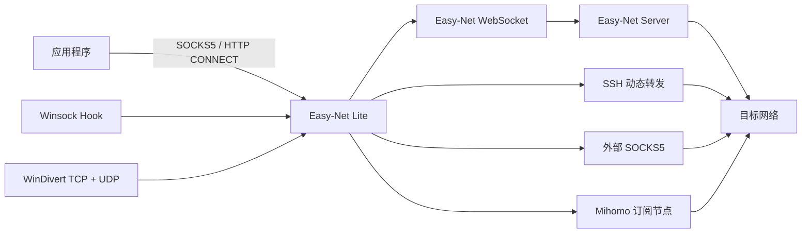

# Easy-Net

[](https://github.com/weirhp/easy-net/actions/workflows/client-hook-build.yml)
[](https://github.com/weirhp/easy-net/actions/workflows/client-lite-build.yml)

Easy-Net 是一套轻量代理与 Windows 应用级网络接管工具。它可以把 Easy-Net WebSocket、SSH、外部 SOCKS5、Clash/Mihomo 订阅和 v2rayN 订阅统一成一个本地代理入口，并让指定应用通过原生代理、Winsock Hook 或 WinDivert 使用该代理。

项目主要由三部分组成：

- **Easy-Net Lite**：常驻托盘的代理管理客户端，支持 Windows 和 macOS。
- **Easy-Net Hook**：Windows 应用启动、Hook 和 WinDivert 接管组件。
- **Easy-Net Server**：可自行部署的 WebSocket TCP/UDP 中继服务端。

> [!IMPORTANT]
> 请仅在获得授权并符合当地法律法规、网络策略和服务条款的环境中使用。代理工具不能替代终端安全、访问控制或数据合规措施。

## 下载与选择

### Windows：推荐完整 x64 包

打开 [Build Easy-Net Hook](https://github.com/weirhp/easy-net/actions/workflows/client-hook-build.yml)，进入最新成功构建，在 **Artifacts** 下载 `Easy-Net-Hook-x64`。

完整包包含：

```text
Easy-Net-Hook-x64\
  Easy-Net-Lite.exe       # 主程序、托盘和管理界面
  easy-net-hook.exe       # 应用启动与后台接管程序
  easy-net-hook.dll       # Winsock Hook
  windivert\              # WinDivert 接管引擎
  mihomo\                 # Clash/v2rayN 订阅运行内核
  zeroomega\              # 可选的 Chromium 代理扩展包
  THIRD-PARTY-LICENSES\
```

日常只需运行 `Easy-Net-Lite.exe`。请保留发布包目录结构，不要单独移动其中的 EXE、DLL、`windivert` 或 `mihomo` 目录。

`Easy-Net-Hook-Win32` 仅用于 32 位 Hook 目标，不包含只支持 x64 的 WinDivert 和 Mihomo。

### macOS 或仅使用代理管理

在 [Releases](https://github.com/weirhp/easy-net/releases) 下载正式版本，或在 [Build Easy-Net Lite](https://github.com/weirhp/easy-net/actions/workflows/client-lite-build.yml) 下载最新构建：

- `Easy-Net-Lite-windows-x64`
- `Easy-Net-Lite-macos-x64`
- `Easy-Net-Lite-macos-arm64`

macOS 支持 Lite 的 WebSocket、SSH 和订阅管理，不包含 Windows Hook/WinDivert 应用接管功能。面向外部分发的 macOS 应用仍需 Developer ID 签名和 Apple 公证。

## 工作方式



Lite 默认在 `http://127.0.0.1:18081` 提供本地管理页面；端口被占用时会自动选择其他回环端口。关闭网页不会停止代理，完全退出需要使用系统托盘菜单。

## 主要功能

### 网络代理管理

- Easy-Net WebSocket 隧道：SOCKS5 TCP、SOCKS5 UDP ASSOCIATE 和 HTTP CONNECT。
- SSH 动态代理：TCP，支持密码、OpenSSH 私钥和加密私钥。
- 外部 SOCKS5：可引用 Clash、v2rayN 或其他已运行的本地代理端口。
- Clash/Mihomo 与 v2rayN 订阅：由独立的 `mihomo/mihomo.exe` 运行选定节点。
- 多配置独立启停、测试连接、自动启动和唯一默认代理。
- 配置分享码批量导入、导出；分享码包含认证信息，应按敏感凭据保护。
- 可选“局域网与私有地址直连”和“中国大陆 IP 直连”。
- 公网域名分流通过当前加密代理访问可信 DoH，降低本机 DNS 污染导致的误分流风险。

### Windows 应用代理管理

- 从运行进程、快捷方式或 EXE 批量添加应用。
- 内置 ChatGPT、Cursor、Antigravity、Claude Code、Chrome、Edge 和微信等常见入口。
- 可创建桌面快捷方式，下次双击即可按保存的代理设置启动。
- 多个应用共享一套 WinDivert 引擎和多条进程规则，降低资源占用。
- 动态显示接管状态；引擎异常退出时自动重启。
- 应用未单独指定代理时，自动继承网络代理页的默认代理。

## 应用代理方式怎么选

| 方式 | 适用场景 | TCP | UDP | 管理员权限 | 说明 |
| :--- | :--- | :---: | :---: | :---: | :--- |
| 原生 Chromium SOCKS5 | Chrome、Edge、ChatGPT、Cursor、Antigravity | ✅ | 不保证 | 否 | 浏览器和 Electron 应用的首选，可把域名交给代理端解析 |
| Winsock Hook | 普通 Win32 程序、Claude Code 等 | ✅ | 默认阻断 | 通常不需要 | 资源占用低，但受进程架构、AppContainer 和代码完整性保护影响 |
| WinDivert 接管 | 已运行程序、微信、需要 TCP+UDP 的程序 | ✅ | ✅ | 需要一次 UAC | 按进程名匹配，只影响后续新连接；同名进程都会命中 |

创建快捷方式和开启 WinDivert 可以同时使用。Lite 会为快捷方式使用的 SOCKS5 端点添加直连规则，避免被 WinDivert 再次代理形成回环。

浏览器推荐使用原生 SOCKS5 快捷方式并保留独立代理配置目录。如果使用 WinDivert 接管浏览器，应同时启用浏览器安全 DNS；WinDivert 位于 IP 层，无法把本机 DNS 已经解析出的错误 IP 恢复成原始域名。

## 五分钟快速开始

1. 下载并解压 Windows x64 完整包。
2. 运行 `Easy-Net-Lite.exe`。
3. 在“网络代理管理”添加以下任一来源：
   - Easy-Net WebSocket 地址和连接密钥；
   - SSH 服务器；
   - Clash/v2rayN 订阅；
   - Clash、v2rayN 等外部 SOCKS5 端口。
4. 测试并启动配置，然后将它设为“默认”。
5. 在“应用代理管理”添加应用：
   - 新启动的 Chrome、Edge、ChatGPT、Cursor 等优先创建桌面快捷方式；
   - 已经运行的应用开启“应用网络接管”；
   - 第一次使用 WinDivert 时接受 Windows UAC 授权。

接管已经运行的程序不会迁移现有连接。请让应用重新连接、重新打开页面，必要时重启目标应用。

## 部署 Easy-Net Server

服务端基于 Node.js、WebSocket 和 SQLite，提供用户管理、连接密钥、流量额度、统计以及 TCP/UDP 中继。推荐在具有公网连接能力的 Linux 服务器上通过 Docker Compose 部署。

```bash
cd server
cp .env.example .env
```

至少修改：

```env
HOST_PORT=3100
CONTEXT_PATH=/easy-net
ADMIN_PASSWORD=change-this-admin-password
CLIENT_WS_URL=wss://proxy.example.com/easy-net/tunnel
```

启动并查看状态：

```bash
chmod +x deploy.sh
./deploy.sh start
./deploy.sh status
```

管理端地址：

```text
http://服务器地址:3100/easy-net/admin
```

生产环境应通过 Nginx、Caddy 或其他反向代理提供 `wss://`，并持久化挂载 `server/data`。Docker 日志默认按 `10 MiB × 3` 轮转；逐连接日志默认关闭。

完整说明见 [server/README.md](server/README.md)。

## 协议与分流边界

- Lite 的本地 SOCKS5/HTTP 混合入口无本地认证，因此只允许监听回环地址。
- Easy-Net WebSocket 支持 TCP 协议 v2 和 UDP 数据报协议 v3；服务端和客户端应同时升级。
- WebSocket 模式可代理公网 UDP、DNS 和 QUIC；SSH 动态转发的公网流量只有 TCP。
- SOCKS5 UDP 不支持分片，单个 UDP 负载最大 65507 字节。
- `ws://` 默认拒绝，生产环境必须使用有效证书的 `wss://`。
- WinDivert 代理不可用时会阻断匹配流量并尝试重启，避免静默改为直连；严格的内核级零窗口 kill-switch 不在当前保证范围内。
- “中国大陆 IP 直连”依赖内置地址表和安全 DNS 结果。浏览器等高度依赖域名的程序仍推荐原生代理模式。

## 配置与日志

Lite 配置目录：

| 平台 | 目录 |
| :--- | :--- |
| Windows | `%AppData%\Easy-Net Lite` |
| macOS | `~/Library/Application Support/Easy-Net Lite` |

主要文件包括：

- `config.json`：网络代理配置。
- `subscriptions.json`：节点订阅。
- `launches.json`：Windows 应用代理配置。
- `easy-net-lite.log`：Lite 日志。
- `shared-windivert-status.json`：共享接管状态。
- `shared-windivert.log`：共享接管日志。

WebSocket 密钥、SSH 密码和私钥口令保存在 Windows Credential Manager 或 macOS Keychain，不写入普通 JSON。Lite 和 Mihomo 日志使用受限轮转，单组不超过 50 MiB；Hook/WinDivert 网络日志限制为 8 MiB。

## 从源码构建

### Easy-Net Lite

需要项目 `go.mod` 指定的 Go 工具链：

```powershell
cd client-lite
go test ./...
go vet ./...
.\scripts\build-windows.ps1
```

macOS：

```bash
cd client-lite
go test ./...
chmod +x scripts/build-macos.sh
./scripts/build-macos.sh
```

### Windows 完整包

需要 Visual Studio 2022 C++ Build Tools、Windows SDK、CMake 和 Go：

```powershell
cd client-hook
.\scripts\build-windows.ps1 -Architecture x64 -Configuration Release -WithMihomo
```

GitHub 构建与打包说明见 [client-hook/GITHUB_BUILD_GUIDE.md](client-hook/GITHUB_BUILD_GUIDE.md)。

## 仓库目录

| 目录 | 状态 | 用途 |
| :--- | :--- | :--- |
| [`client-lite`](client-lite/README.md) | 当前主线 | Lite 托盘、代理管理、订阅和应用管理 |
| [`client-hook`](client-hook/README.md) | 当前主线 | Windows Hook、WinDivert、完整包构建 |
| [`server`](server/README.md) | 当前主线 | Easy-Net WebSocket TCP/UDP 服务端 |
| [`client`](client/README.md) | 旧版 | 旧 Windows 客户端管理器，新部署不建议使用 |
| [`server-cf`](server-cf/README.md) | 独立辅助项目 | Cloudflare Worker 网页反向代理，不是 Easy-Net WebSocket 服务端 |

## 当前限制

- Windows 应用接管功能不支持 macOS。
- WinDivert 仅随 x64 完整包发布，需要管理员授权。
- Hook DLL 必须与目标进程架构匹配；受保护进程可能拒绝注入。
- 应用内置特殊网络栈、内核驱动或自定义 DoH/QUIC 行为时，需要单独验证实际流量路径。
- Mihomo 只负责运行订阅节点，不是 Hook/WinDivert 接管引擎；应用选择订阅节点时，流量仍会经过 Mihomo 提供的本地 SOCKS5 端口。

## 更多文档

- [Easy-Net Lite 使用与协议说明](client-lite/README.md)
- [Easy-Net Hook 使用、命令行和日志](client-hook/README.md)
- [GitHub 构建说明](client-hook/GITHUB_BUILD_GUIDE.md)
- [Easy-Net Server 部署与接口](server/README.md)

## 第三方组件与免责声明

Windows 完整包使用 Microsoft Detours、WinDivert、ProxyBridge、Mihomo 和 ZeroOmega。相应许可证和版本信息随构建产物分发。

本项目按现状提供，不保证适合任何特定用途。使用者应自行评估代理服务、第三方节点、远端服务器和网络接管对隐私、安全、账号风控及业务连续性的影响。
