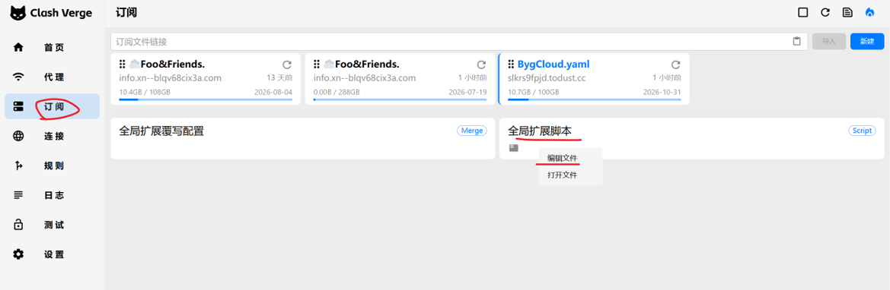

# Easy-Net 使用与部署说明

本项目是基于 WebSocket 与 Go/Node.js 实现的网络中继工具。本文档旨在指导您如何配置客户端以及如何在第三方平台（以 Hugging Face Spaces 为例）或 VPS 上自行搭建中继服务。

---

## 1. 本地客户端配置

在本地客户端文件夹中，找到名为 `local-config.json` 的配置文件。如果该文件不存在，可复制 `local-config.json.example` 并重命名为 `local-config.json`。

使用文本编辑器打开它，并根据您服务端的实际参数进行配置：

```json
{
  "workerHost": "your-server-domain.com",
  "localPort": 1080,
  "secret": "easy-net-secret-key-12345"
}
```

**参数说明：**

* **`workerHost`**：远程中继服务器的域名或公网 IP 地址（注意：不要带 `http://` 或 `https://` 前缀）。
* **`localPort`**：本地客户端所开启的 SOCKS5 本地代理端口（默认：`1080`）。
* **`secret`**：与服务端约定的安全认证密钥（必须与服务端 `SECRETS` 环境变量中的其中一个密钥一致）。

---

## 2. 客户端运行方法

### Windows 系统

直接运行编译出的可执行文件即可：

* **`proxy-windows-amd64.exe`**：带有控制台日志窗口的版本，适合用于调试和直观查看运行日志。
* **`proxy-windows-amd64-silent.exe`**：无窗口静默版本，程序将在后台静默运行。

### macOS 系统

请根据您的 Mac 处理器架构选择对应的版本：

* **`proxy-mac-amd64`**：适用于搭载 Intel 处理器的 Mac 电脑。
* **`proxy-mac-arm64`**：适用于搭载 Apple Silicon 处理器（M1/M2/M3/M4）的 Mac 电脑。

**运行步骤：**

1. 打开终端（Terminal），并切换到文件所在目录。
2. 赋予程序执行权限：

   ```bash
   chmod +x proxy-mac-arm64
   ```

3. 运行程序：

   ```bash
   ./proxy-mac-arm64
   ```

4. 如果希望在后台持久化运行，可以使用如下命令：

   ```bash
   nohup ./proxy-mac-arm64 >/dev/null 2>&1 &
   ```

---

## 3. 对接分流客户端（以 Clash 等工具为例）

如果您想将本地建立的 Easy-Net 加密通道与分流工具对接，以便实现自动分流，可以通过自定义配置脚本（如 Mixin 脚本）来实现。

### 配置方式

在您的 Clash 客户端中，找到“配置扩展（Mixin）”或“预处理脚本”设置项，如下图所示：



添加以下 JavaScript 逻辑进行动态插入：

```javascript
function main(config, profileName) {
  // 定义 Easy-Net 本地节点
  const localNode = {
    name: "Easy-Net 本地加密通道",
    type: "socks5",
    server: "127.0.0.1",
    port: 1080, // 需与 local-config.json 中的 localPort 保持一致
    udp: false  // 显式关闭 UDP，使 DNS/UDP 流量自动走直连或其它分流
  };

  // 初始化节点列表并将新节点插入到首位
  if (!config.proxies) config.proxies = [];
  config.proxies.unshift(localNode);

  // 将该本地加密通道节点添加进每一个策略分流组
  if (config["proxy-groups"]) {
    for (let group of config["proxy-groups"]) {
      if (group.proxies && Array.isArray(group.proxies)) {
        group.proxies.unshift(localNode.name);
      }
    }
  }

  // 避免回环：添加进程直连规则，使 Easy-Net 客户端本身不受策略组影响而产生循环请求
  const prependRules = [
    'PROCESS-NAME,proxy-mac-arm64,DIRECT',
    'PROCESS-NAME,proxy-mac-amd64,DIRECT',
    'PROCESS-NAME,proxy-windows-amd64.exe,DIRECT',
    'PROCESS-NAME,proxy-windows-amd64-silent.exe,DIRECT'
  ];
  
  config.rules = prependRules.concat(config.rules); // 将直连规则添加到规则数组最前面
  return config; // 返回修改后的配置对象
}
```

配置脚本完成后，保存并开启对应客户端的 Mixin/配置拦截 功能，在节点列表中选择 **Easy-Net 本地加密通道** 即可。

---

## 4. 自建中继服务节点

您可以使用 VPS 部署或者免费部署在 Hugging Face Spaces 平台上。
